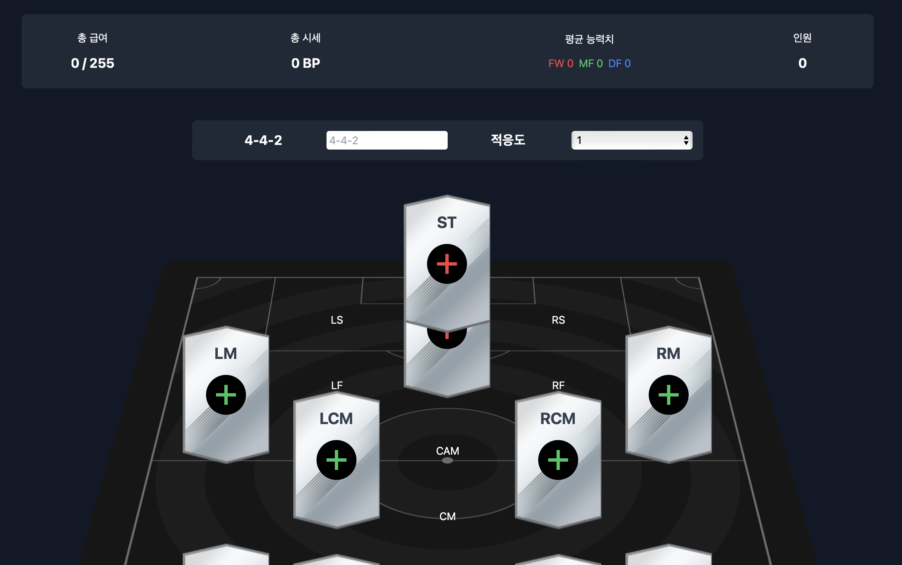

<h1>스쿼드 메이커</h1>

카드의 상호작용 기능 구현, 시세 및 선수 정보 등은 크롤링으로 직접 구현했습니다.  
드래그&드롭 기능은 PC 버전만 지원하고 있습니다.

서버 스펙 문제로 크롤링 속도가 많이 느립니다.

피파온라인 스쿼드메이커 - [https://fconline.nexon.com/datacenter/squadmaker](https://fconline.nexon.com/datacenter/squadmaker)

프로젝트 배포 링크 - [http://13.125.202.106:3000/squad](http://13.125.202.106:3000/squad)

    

        <h4>사용 기술 스택</h4>
    

    

        
        
        
    

<h2>기능 정리</h2>
<h3>선수 배치/이동</h3>
선수를 선택하여 스쿼드에 배치한 다음 선수를 드래그앤드롭하여 원하는 필드에 이동시킬 수 있습니다. 
이 방법 이외에도 적응도 우측에 있는 입력란에서 포메이션을 선택해 원하는 진영을 고를 수 있습니다.
<h3>선수 추가</h3>
입력된 링크에서 선수 정보를 추출합니다. 
정보를 추출해 DB에 저장하고 목록를 다시 조회합니다. 
서버 스펙이 많이 낮기 때문에 크롤링 속도가 많이 느립니다.
<h3>선수 목록</h3>
비어있는 카드의 + 버튼을 눌러 조회할 수 있습니다. 
목록에서 선수를 클릭하여 스쿼드에 추가하거나 새로고침 아이콘을 눌러 시세를 다시 조회할 수 있습니다.

